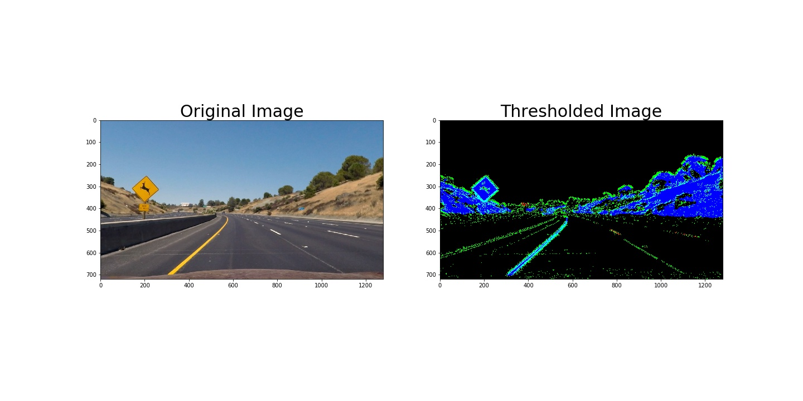
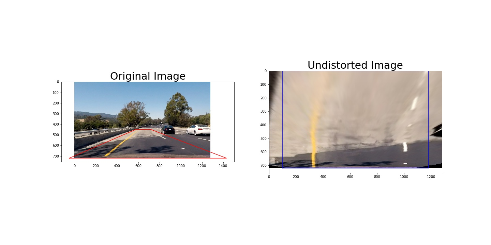

Writeup
-------

**Advanced Lane Finding Project**

The goals / steps of this project are the following:

-   Compute the camera calibration matrix and distortion coefficients given a
    set of chessboard images.

-   Apply a distortion correction to raw images.

-   Use color transforms, gradients, etc., to create a thresholded binary image.

-   Apply a perspective transform to rectify binary image ("birds-eye view").

-   Detect lane pixels and fit to find the lane boundary.

-   Determine the curvature of the lane and vehicle position with respect to
    center.

-   Warp the detected lane boundaries back onto the original image.

-   Output visual display of the lane boundaries and numerical estimation of
    lane curvature and vehicle position.

[Rubric](https://review.udacity.com/#!/rubrics/571/view) Points
---------------------------------------------------------------

### Here I will consider the rubric points individually and describe how I addressed each point in my implementation.

### Writeup / README

#### 1. Provide a Writeup / README that includes all the rubric points and how you addressed each one. You can submit your writeup as markdown or pdf. [Here](https://github.com/udacity/CarND-Advanced-Lane-Lines/blob/master/writeup_template.md) is a template writeup for this project you can use as a guide and a starting point.

You're reading it!

### Camera Calibration

#### 1. Briefly state how you computed the camera matrix and distortion coefficients. Provide an example of a distortion corrected calibration image.

The code for camera calibration is contained in the file `camera.py` in the source folder of my project. There is a `Calibration` class that can be instantiated with calibration images. Once calibrated, the camera matrix   and distortion coefficients are stored to disk and retrieved quickly on subsequent calibrations.

I start by preparing "object points", which will be the (x, y, z)
 coordinates of the chessboard corners in the world. Here I am assuming the
 chessboard is fixed on the (x, y) plane at z=0, such that the object points
 are the same for each calibration image. Thus, the object points are just a
 replicated array of coordinates, and this value is duplicated for each
 chessboard image. The image points array is appended with the (x, y) pixel
 position of each of the corners in the image plane with each successful
 chessboard detection.

Then the object and image points are used to compute the camera
calibration and distortion coefficients using the `cv2.calibrateCamera()`
function. I applied this distortion correction to test images using the
`cv2.undistort()` function. Here is an example chessboard before and after applying the undistortion.

### Pipeline (single images)

#### 1. Provide an example of a distortion-corrected image.

Correcting a test image from the car camera for camera distortion is exactly the same as correcting a chessboard image as described above. Below is an example on one of the test images.

#### 2. Describe how (and identify where in your code) you used color transforms, gradients or other methods to create a thresholded binary image. Provide an example of a binary image result.

I used a combination of color and gradient thresholds to generate a binary image used to detect lane lines. There are several helper functions in `thresholding.py` in the source directory of the project that apply sobel gradient thresholding, both in the x- or y-direction, in absolute magnitude, or according to the sobel gradient direction; these helpers functions are largely derived from the Udacity lessons leading up to the project. I also used color thresholding, and color thresholding alongisde sobel gradient thresholding, to help isolate the lane lines.

I utilized two color spaces other than the typical RGB/BGR. I used [LUV](https://en.wikipedia.org/wiki/CIELUV) and [LAB](https://en.wikipedia.org/wiki/Lab_color_space) to help isolate lane line colors more effectively. I used the L-channel of the LUV color space to try to isolate the white lane lines --- the L-channel represents the lightness of the image and is well-suited to finding the very white lane lines. The b-channel of the LAB color space was used to try to isolate the orange/yellow lane lines --- the b-channel detects particular color hues, even in changing lightness conditions (e.g. in shadows on the road).

The final edge detection binary image (implemented in `get_edge_mask` in `thresholding.py`) combines sobel thresholds in the x- and y-directions, total sobel gradient magnitude, and sobel gradient direction magnitude, for the l- and b-channels of the LUV and LAB color spaces, respectively, with independent color thresholds in the l- and b-channels of the image.

A final binary image can be seen below. The red color is the l-channel threshold; the green color is the combination of sobel gradient thresholds; the blue color is the b-channel threshold.

By combining the three channels of this binary image, we get a single binary image that represents regions of interest that we perform windowing on to obtain the location of the lane lines.

#### 3. Describe how (and identify where in your code) you performed a perspective transform and provide an example of a transformed image.

Perspective transforms were performed in my Jupyter notebook (`Notebook.ipynb` in the sources directory) and also in my lane line tracker object (`LaneLineTracker` class in `lane_line_tracker.py` in the sources directory).

To transform perspectives, a collection of source and destination points were constructed such we would transform our perspective from looking down the road to a view above the road, with lane lines parallel. The source and destination lines were chosen as follows.

~~~~~~~~~~~~~~~~~~~~~~~~~~~~~~~~~~~~~~~~~~~~~~~~~~~~~~~~~~~~~~~~~~~~~~~~~ python
SOURCE_POINTS = np.float32([
    [-100, H], 
    [W / 2 - 76, H * .625],
    [W / 2 + 76, H * .625],
    [W + 100, H]
])
DESTINATION_POINTS = np.float32([
    [100, H],
    [100, 0],
    [W - 100, 0],
    [W - 100, H]
])
~~~~~~~~~~~~~~~~~~~~~~~~~~~~~~~~~~~~~~~~~~~~~~~~~~~~~~~~~~~~~~~~~~~~~~~~~~~~~~~~

This resulted in the following source and destination points:

| Source    | Destination |
|-----------|-------------|
| -100, 720 |  100, 720   |
|  564, 450 |  100, 0     |
|  716, 450 |  1180, 0    |
| 1380, 720 |  1180, 720  |

I verified that my perspective transform was working as expected by drawing the
`src` and `dst` points onto a test image and its warped counterpart to verify
that the lines appear parallel in the warped image. An example of this visualization can be seen in the following figure.

#### 4. Describe how (and identify where in your code) you identified lane-line pixels and fit their positions with a polynomial?

First we used our edge detection tools (sobel gradients and color thresholding) to create a binary image with segments that might represent lane lines set to a non-zero value.

We then identified lane line pixels by identifying peaks in horizontal slices of the image as represented as a histogram (i.e., where, horizontally, the highest brightness pixels lie). Starting at the bottom, we found the location in the image's width of peak brightness in a short and wide rectangle. Once this region was identified, we used windows subsequently above the previous window and found another histogram peak, limiting the horizontal movement the window is allowed to move per step.

These windows gave course resolution regions where lane line pixels might lie. By combining the found windows with the actual pixels, we identifier the pixels that were likely associated with the lane lines in an image.

Helper functions to implement the windowing technique can be found in `window.py` in the sources directory of the project.

Once these pixels were identified, we fit 2nd-order polynomials to the points using NumPy's `polylines` function. For a visualization of this process, including isolating lane lines and fitting a line to their shape, see the following figure from Udacity's lectures.

#### 5. Describe how (and identify where in your code) you calculated the radius of curvature of the lane and the position of the vehicle with respect to center.

After the lane lines' best-fit polynomial was calculated, it is relatively straightforward to obtain a radius of curvature for the lane line. This calculation is performed in `lane_line.py` in the sources directory.

We used the formula given in the Udacity lectures to calculate the radius of curvature for an arbitrary function `x = f(y)`. Using the best-fit coefficients, returning the radius of curvature for a best-fit line function was a straight-forward calculation, performed in the `LaneLine` class in the `lane_line.py` file in the sources directory of the project. We also made sure to convert to physical units from pixel units. The curvature of the lane lines is shown frame-by-frame in the final video.

#### 6. Provide an example image of your result plotted back down onto the road such that the lane area is identified clearly.

After obtaining best-fit lines for the lane lines, we created a filled polygon representing the space we estimated the lane to be in going forwards. To visualize this result, it was useful to plot the lane line back into a "normal" perspective. To do this, we simply perform the same perspective shift performed earlier to shift to a "bird's-eye" view, except with source and destination points reversed. This reverse transformation, with a bit of image annotation, serves as the processed frame for our output video.

An example of this processing step for a test image can be seen below.

### Pipeline (video)

#### 1. Provide a link to your final video output. Your pipeline should perform reasonably well on the entire project video (wobbly lines are ok but no catastrophic failures that would cause the car to drive off the road!).

The output video can be found [here](./project_video_output.mp4).

### Discussion

#### 1. Briefly discuss any problems / issues you faced in your implementation of this project. Where will your pipeline likely fail? What could you do to make it more robust?

Overall the image processing pipeline does an excellent job finding lanes. There are a few small parts of the project video that have problems, but the problems are isolated to the farthest-away portions of the image, i.e., the regions of the image that have the least spatial resolution when transformed to a bird's-eye view, and where the shadows and lane line fidelity is worst. During this region of non-ideal performance, the portion of the lane line found immediately in front of the car is still accurate and I expect a control system based on this analysis would work fine.

The image processing pipeline performs unacceptly poor in the challenge videos, and unfortunately I didn't quite have enough time to improve the pipeline to perform well in these. These videos showcase a lot of difficult scenarios, including edge-like features in the road parallel to lane lines that nevertheless do not represent real lane lines (e.g. pavement repairs on the road). 

In the extra challenge video, the car is also navigating at a much slower speed (making our hardcoded perspective shift region inappropriate) and through much higher curve radii (again, showing the poor performance of our hard-coded technique).

To improve performance in some of these more difficult situations, a huge improvement would be to dynamically discover the region that should be perspective-shifted to most appropriately obtain a relevant bird's-eye view for the pipeline to analyze. We also don't apply any logic when detecting lane lines using our windowing technique, and so spurious edge detections are common in the more difficult videos. We could use domain-specific knowledge of how lane lines are likely to behave to improve these spurious and erroneous detections.
